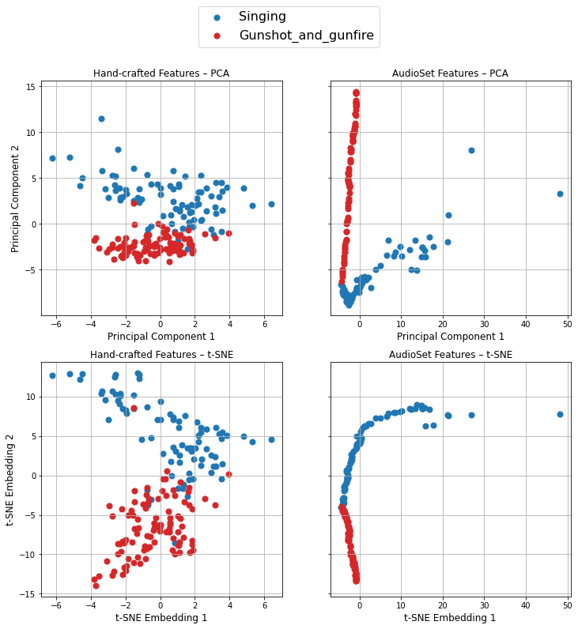
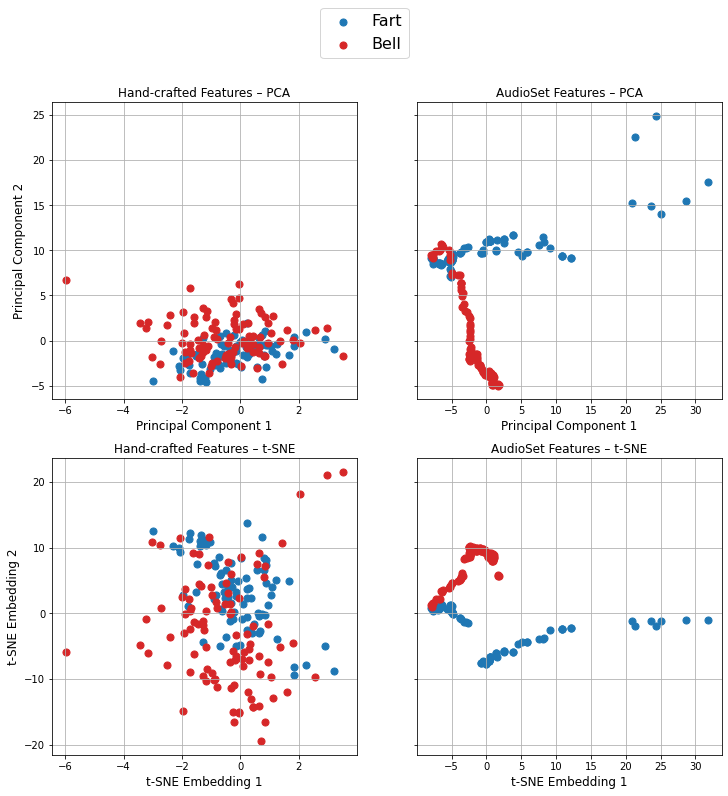

# Comparison of 2-D timbre spaces for Freesound sounds
This code is part of my final project for the Music Information Retrieval course of the Sound and Music Computing Master at the Music Technology Group, in Universitat Pompeu Fabra (Barcelona). 

The notebook compares four different 2-D timbre spaces to visualize Freesound sounds, result of the combination of two feature extraction methods and two dimensionality reduction techniques.
The first feature extraction method uses hand-crafted features, while the second one uses a pretrained VGGish model as feature extractor (AudioSet features). For reducing dimensionality, PCA and t-SNE techniques are used. The evaluation partition of FSD50K, which is ground truth annotated, is employed. Since these annotations are meant for audio event classification and not for timbre classification, only pairs of contrasting and specific labels are selected: Singing-Gunshot_and_gunfire and Fart-Bell. The spaces are evaluated comparing four clustering methods to the ground truth partitions, utilizing the Adjusted Mutual Information score. Results seem to follow the tendency, as suggested by the literature, that AudioSet features help separate timbres better than hand-crafted features. However, further experiments with more label pairs should be performed to be able to draw any significant conclusion.

Here are the final 2-D visualizations colored according to the ground truth labels of the data:

 

 

 See my [class paper](Gonzalo_Nieto_Montero_MIR_Final_Project.pdf) for more information.
